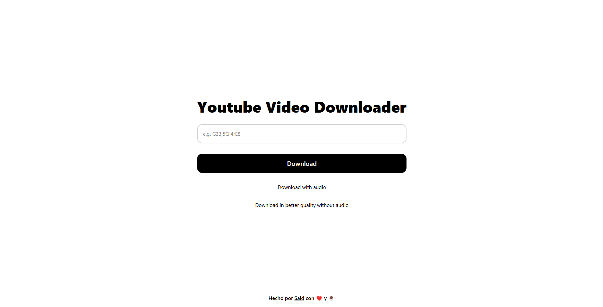

# 🎬 Youtube Video Downloader

¡Bienvenido a **Youtube Video Downloader**! 🚀

Una aplicación web sencilla y moderna que te permite **descargar videos de YouTube** de forma rápida y fácil.  
Ideal para practicar tus habilidades de desarrollo web y aprender sobre integración de APIs, React, Express y TailwindCSS.

## ✨ Características

- 🎥 Descarga videos de YouTube ingresando solo el ID del video.
- 🔊 Opción para descargar con audio o en mejor calidad sin audio.
- ⚡ Interfaz minimalista, intuitiva y responsiva.
- 🛡️ Tu clave de API está protegida: nunca se expone en el frontend.
- 🧩 Backend construido con Express y frontend con React + TailwindCSS.

## 🖼️ Vista previa



## 🚦 ¿Para qué sirve este proyecto?

> **Este proyecto es únicamente para fines educativos y de aprendizaje.**  
> **No está diseñado ni debe ser utilizado para descargar videos de YouTube sin el permiso del creador de contenido.**  
> Aprende sobre consumo de APIs, manejo de estados en React y buenas prácticas de seguridad en proyectos web.

## ⚙️ Tecnologías utilizadas

- React
- Express
- TailwindCSS
- RapidAPI (Youtube Media Downloader)
- Vite

## 📝 Instalación y uso

1. Clona este repositorio:
   ```bash
   git clone https://github.com/tuusuario/youtubedownloader.git
   ```

2. Instala las dependencias:
    ```bash
    npm install
    ```

3. Crea un archivo `.env` en la raíz con tu clave de RapidAPI:
    ```plaintext
    VITE_YOUTUBE_API_KEY=tu_clave_aqui
    ```

4. Inicia el servidor
    ```bash
    npm run start
    ```

5. En otro terminal, inicia el frontend:
    ```bash
    npm run dev
    ```

## ⚠️ Disclaimer

Este proyecto es solo para fines educativos.
No fomenta ni aprueba la descarga de contenido protegido por derechos de autor sin el consentimiento del creador.
¡Respeta siempre las políticas de YouTube y los derechos de los creadores! 🙏

## 🧑🏻‍💻 Creador

Carta de presentación: [Said Ruiz](https://said-beta.vercel.app)
Correo: [mathiassaid7@gmail.com](mailto:mathiassaid7@gmail.com)
Portfolio: [Said](https://said-portfolio-three.vercel.app)